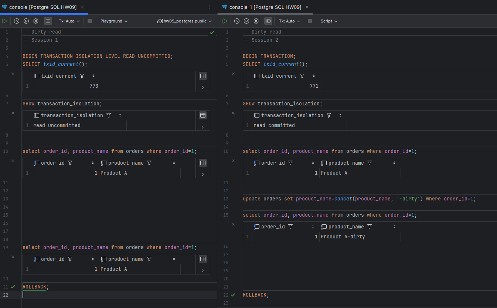

# PostgreSQL

## 1. Dirty read

Not reproducible since READ UNCOMMITTED acts as READ COMMITTED.

## 2. Lost update

Reproducible in READ COMMITTED:

Non-reproducible in REPEATABLE READ and up:

Update in the second transaction fails. 

## 3. Non-repeatable read

Reproducible in READ COMMITTED:

Non-reproducible in REPEATABLE READ and up:

## 4. Phantom read

Reproducible in READ COMMITTED:

Non-reproducible in REPEATABLE READ and up:

