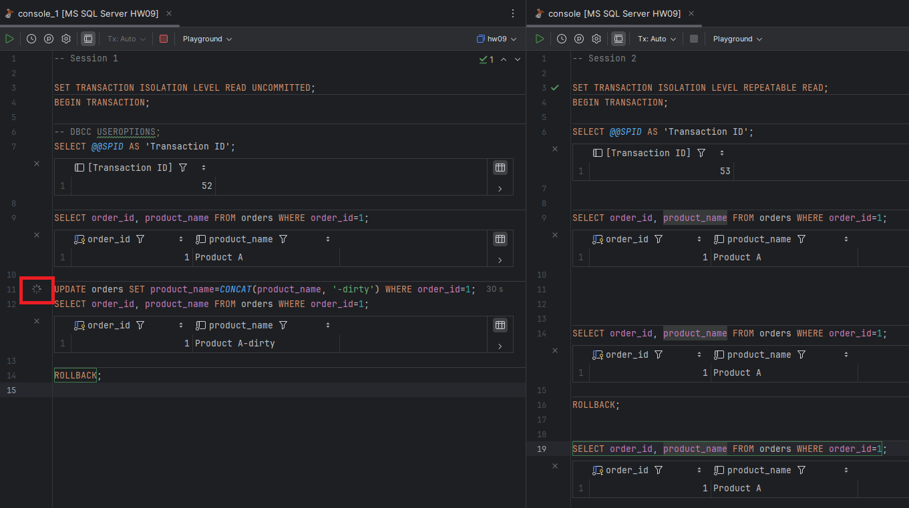

# PostgreSQL

## 1. Dirty read

Not reproducible since READ UNCOMMITTED acts as READ COMMITTED.
Returns last commited value:

## 2. Lost update

Reproducible in READ COMMITTED:

Non-reproducible in REPEATABLE READ and up:

Update in the second transaction fails.

## 3. Non-repeatable read

Reproducible in READ COMMITTED:

Non-reproducible in REPEATABLE READ and up:

## 4. Phantom read

Reproducible in READ COMMITTED:

Non-reproducible in REPEATABLE READ and up:

But SERIALIZABLE prevents two inserts from concurrent transactions (Write skew):

# MS SQL Server

## 1. Dirty read

Reproducible in READ UNCOMMITTED:

Non-reproducible in READ COMMITTED, READ operation is blocked!:

Non-reproducible in REPEATABLE READ, SERIALIZABLE. WRITE operation is blocked!:

Non-reproducible in SNAPSHOT, no blocking:

## 2. Lost update

Reproducible in READ UNCOMMITTED:

Reproducible in READ COMMITTED. Second write is BLOCKED until first transaction completes, but then overwrites the value:

Reproducible in REPEATABLE READ. But if both transactions have read operations preceeding write, then deadlock occures and the second transaction rolls back having changes from T1 applied.

Reproducible in SERIALIZABLE:

Non-reproducible in SNAPSHOT:

## 3. Non-repeatable read

Reproducible in READ COMMITTED, also READ operation is blocked!:

Non-reproducible in REPEATABLE READ, SERIALIZABLE. WRITE operation is blocked!

Non-reproducible in SNAPSHOT, no blocking:

## 4. Phantom read

Reproducible in READ COMMITTED, REPEATABLE READ:

Non-reproducible in SERIALIZABLE, SNAPSHOT:

## 5. Write skew

Reproducible in READ COMMITTED, REPEATABLE READ:

Non-reproducible in SERIALIZABLE, deadlock in T2:

Reproducible in SNAPSHOT:

# Summary

https://docs.google.com/spreadsheets/d/1sWbs3z_XUMJo1kOhZ3mikj6bNDD-mkQgijVvWthM8dM/edit?usp=sharing
